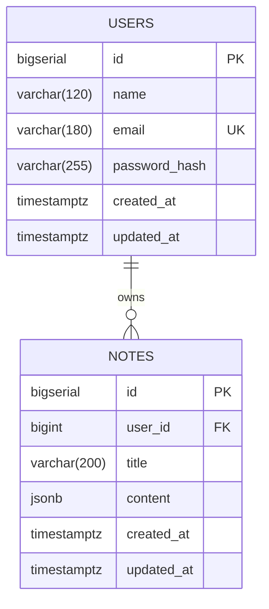

# Entity-Relationship Diagram

Phase 1 deliverable per the STS (Section 6: Database Design). Two tables,
one-to-many, enforced with a cascading foreign key so deleting a user
cleans up their notes automatically.

## Notes

- `notes.user_id` references `users.id` with `ON DELETE CASCADE` — removing
  a user removes all of that user's notes in the same transaction; the
  application layer never has to do this manually.
- `users.email` carries a `UNIQUE` constraint and its own index
  (`idx_users_email`), since every login looks a user up by email.
- `notes.user_id` is indexed (`idx_notes_user_id`), since every notes query
  in the app is scoped to `WHERE user_id = :currentUser`.
- `notes.content` is `JSONB` rather than plain `TEXT` so the rich-text
  editor's structured output (e.g. a Quill/Slate delta) can be stored,
  queried, and validated as real JSON rather than an opaque blob.
- Both tables auto-maintain `updated_at` via the shared `set_updated_at()`
  trigger function (see `backend/migrations/000_create_updated_at_function.sql`).
- Source of truth: `backend/migrations/001_create_users_table.sql` and
  `002_create_notes_table.sql`. This diagram is descriptive, not
  authoritative — if the two ever disagree, the migrations win.
